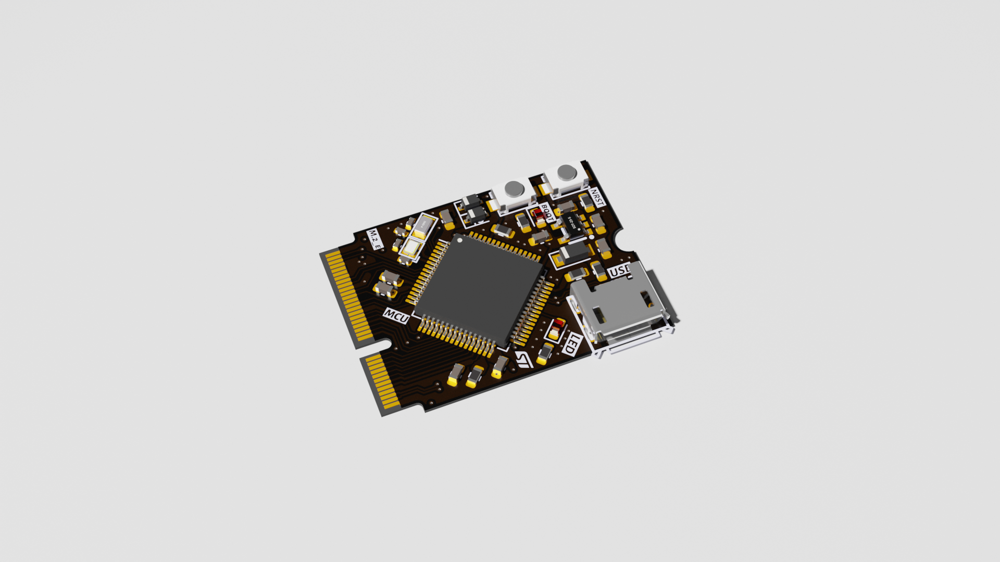
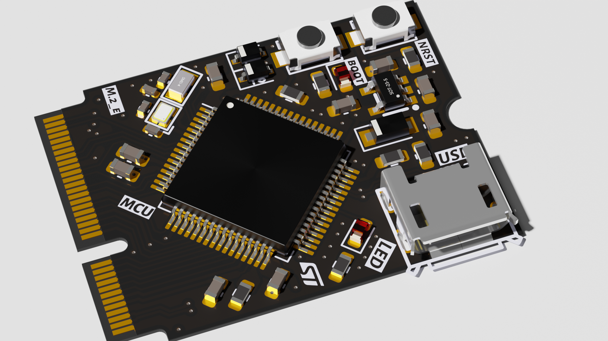
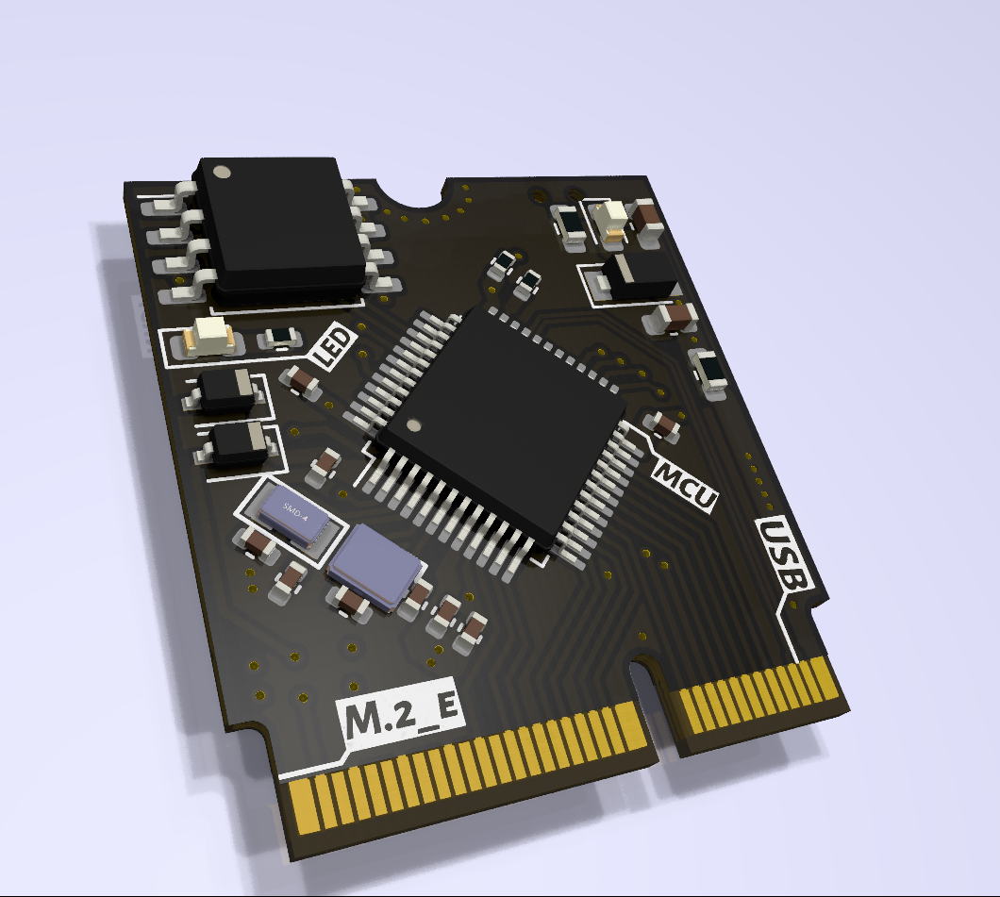
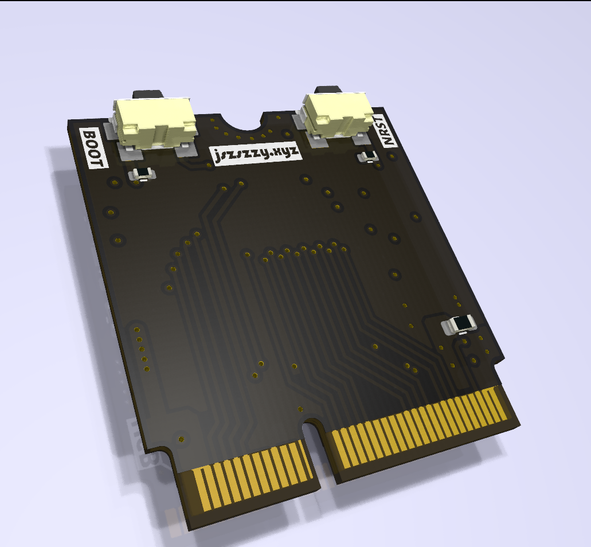
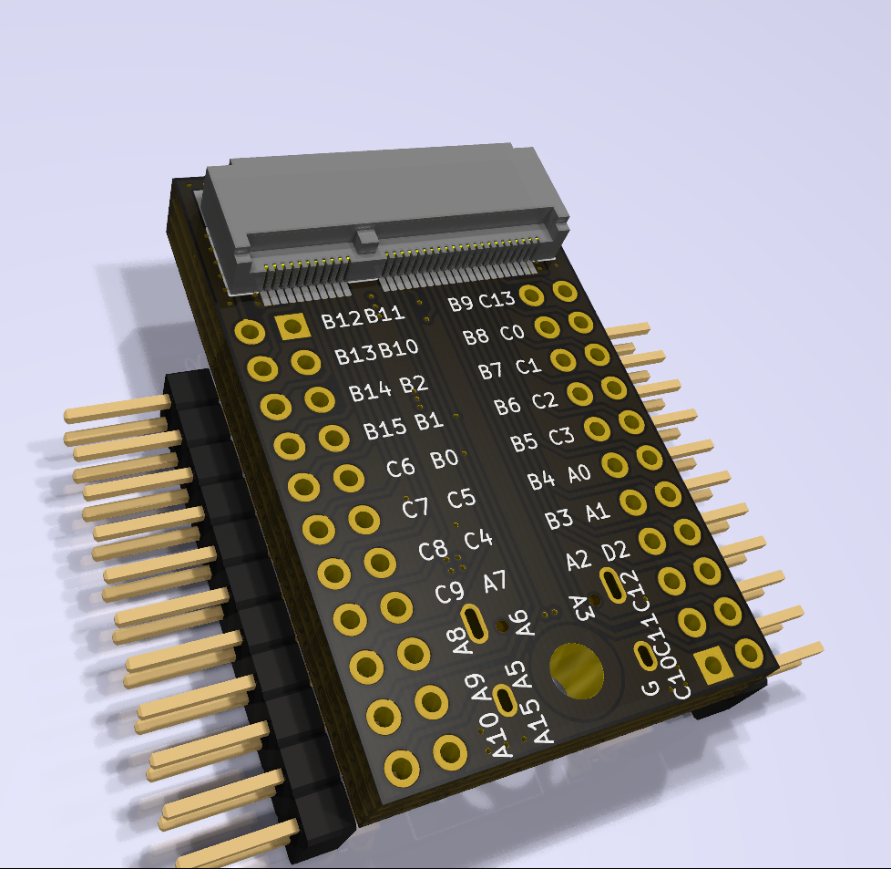

# Auraro

#### 介绍
​	为了不重复造轮子，通过高密度M.2接口设计板卡，欢迎各位复现，提出意见，更欢迎推出不同芯片的版卡、不同功能的底板。

#### 软件使用推荐

KiCAD 6.0 [ PCB ]:[下载地址](https://www.kicad.org/)

Blender 3.0 [ 3D  ]

#### 硬件架构
M.2/NGFF : A B E M B+M 四种型号。

推荐设计符合NGFF规范，从而实现板卡间的兼容。

NGFF 规范文档：见Docs目录下。

现有芯片支持：

- STM32-LQFP48(All_Suppoort) -- NGFF_2230
- ESP-C3 -- NGFF_2230
- STM32-LQFP32(All_Suppoort) -- NGFF_2220

#### 使用说明

​	 现阶段因为两个板子都是刚刚打板，没有进行完全测试，为了每个板子都能完美正常工作，会出一个完备测试的流程，通过测试即可提交。

目前状态：

测试底板已更新，typec正反插可切换USB和串口通信。

目前已有板卡展示：

STM32_LQFP64：

STM32_LQFP64：

STM32_LQFP32：

测试底板：

#### 参与贡献

1.  Fork 本仓库
2.  新建 Feat_xxx 分支
3.  提交代码
4.  新建 Pull Request
